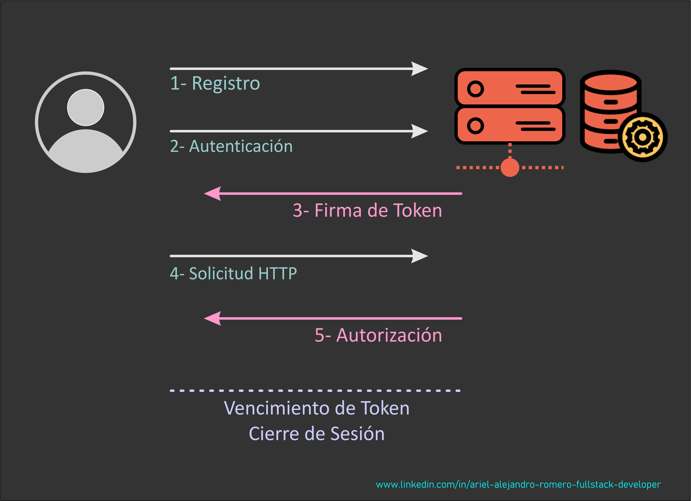

# Nest JS - Nest JS Authentication I

[Volver a Inicio](../../README.md)

## 🎯Bcrypt

- [bcript - Documentación](https://bcrypt.online/)

### Comando de Instalación

```bash
npm install bcrypt
```

### Cost Factor en bcrypt

Es un parámetro que determina cuántas veces se aplica el algoritmo de cifrado para una contraseña, lo que afecta tanto a la seguridad como al tiempo de procesamiento necesario para cifrar y verificar la contraseña. El Cost Factor también se conoce como **work factor** o **log rounds**.

- Cuanto mas alto, mayor seguridad y costo de procesamiento.
- 10 es un valor equilibrado entre seguridad y costo de procesamiento.

## 🎯JWT - JSON Web Token

- [JWT - JSON Web Token - Documentación](https://jwt.io/)

Un JWT (JSON Web Token) es un token de autenticación/autorización compacto y seguro que se usa para intercambiar información entre partes, especialmente en aplicaciones web.

### Estructura de un JWT

Un JWT tiene 3 partes, separadas por puntos (.):

```cpp
HEADER.PAYLOAD.SIGNATURE
```

Ejemplo:

```cpp
eyJhbGciOiJIUzI1NiIsInR5cCI6IkpXVCJ9.       // Header
eyJzdWIiOiIxMjM0NTY3ODkwIiwibmFtZSI6IkFy... // Payload
SflKxwRJSMeKKF2QT4fwpMeJf36POk6yJV_adQssw5c // Signature
```

#### 1. Header

Guarda información sobre el algoritmo que utiliza y el tipo:

```json
{
  "alg": "HS256", // Algoritmo de firma (ej: HMAC-SHA256)
  "typ": "JWT"
}
```

#### 2. Payload (datos)

Contiene la información que se quiere transmitir, como:

```json
{
  "sub": "1234567890", // ID del usuario
  "name": "Ariel",
  "role": "admin",
  "exp": 1691459200 // Fecha de expiración (timestamp)
}
```

⚠️ No se debe incluir información sensible (como contraseñas), ya que el payload no está cifrado, solo firmado.

#### 3. Signature (firma)

Sirve para verificar que el token no fue modificado.

Se genera utilizando la clave secreta.

```scss
HMACSHA256(
  base64UrlEncode(header) + "." + base64UrlEncode(payload),
  secret
)
```

#### ¿Cómo se usa?

1. El usuario se logea → el servidor genera un JWT y lo envía.
2. El cliente (ej: navegador) lo guarda (en localStorage, sessionStorage o cookie).
3. En cada request, el cliente lo envía en el header:

```makefile
Authorization: Bearer <JWT>
```

El servidor verifica la firma y, si es válida y no está expirado, permite el acceso.

### Ventajas

- Stateless: No requiere mantener sesión en el servidor.
- Portátil: Se puede usar entre distintos servicios.
- Compacto: Ideal para uso en URLs, headers o almacenamiento local.

### Desventajas

- No revocable fácilmente (a menos que se guarde en una blacklist).
- El payload es legible (base64, no cifrado).
- Si el token es robado, se puede usar hasta que expire.

### Comando de Instalación

- Instalar tipos de JWT:

```bash
npm install --save @nestjs/jwt
```

## Autenticación y Autorización

> La autenticación y la autorización son dos conceptos fundamentales en la seguridad informática, pero tienen funciones distintas.



### Autenticación (Authentication):

- Definición: Es el proceso de verificar la identidad de un usuario o sistema.
- Objetivo: Asegurarse de que la persona o sistema es quien dice ser.
- Métodos Comunes: Uso de contraseñas, tarjetas de identificación, biometría (huellas dactilares, reconocimiento facial), tokens de seguridad, etc.
- Ejemplo: Ingresar a un sistema con un nombre de usuario y una contraseña. Aquí, el sistema verifica que la combinación de credenciales es válida.

### Autorización (Authorization):

- Definición: Es el proceso de verificar si un usuario o sistema autenticado tiene permiso para acceder a un recurso o realizar una acción específica.
- Objetivo: Asegurarse de que el usuario o sistema tiene los derechos necesarios para acceder a los recursos o realizar las operaciones solicitadas.
- Métodos Comunes: Listas de control de acceso (ACLs), roles y permisos, políticas de acceso basadas en atributos.
- Ejemplo: Un usuario que se ha autenticado en un sistema intenta acceder a un archivo. El sistema verifica si ese usuario tiene los permisos necesarios para leer, escribir o modificar ese archivo.

### Diferencias Clave:

- Orden de Ejecución: La autenticación siempre se realiza antes de la autorización. Primero se verifica la identidad, y luego se determina si esa identidad tiene los permisos adecuados.
- Función: La autenticación se centra en confirmar "quién eres", mientras que la autorización se centra en determinar "qué puedes hacer".
- Resultado: La autenticación da como resultado la confirmación de la identidad del usuario. La autorización da como resultado la concesión o denegación de acceso a recursos específicos basados en permisos.
- Ambos procesos son cruciales para la seguridad de los sistemas, ya que ayudan a proteger contra el acceso no autorizado y el uso indebido de recursos.

[Volver a Inicio](../../README.md)
